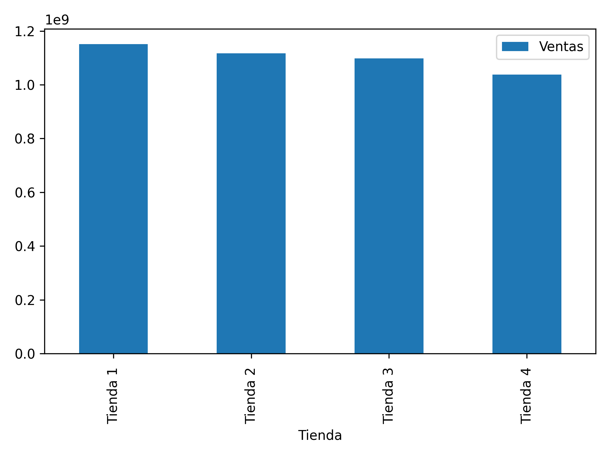
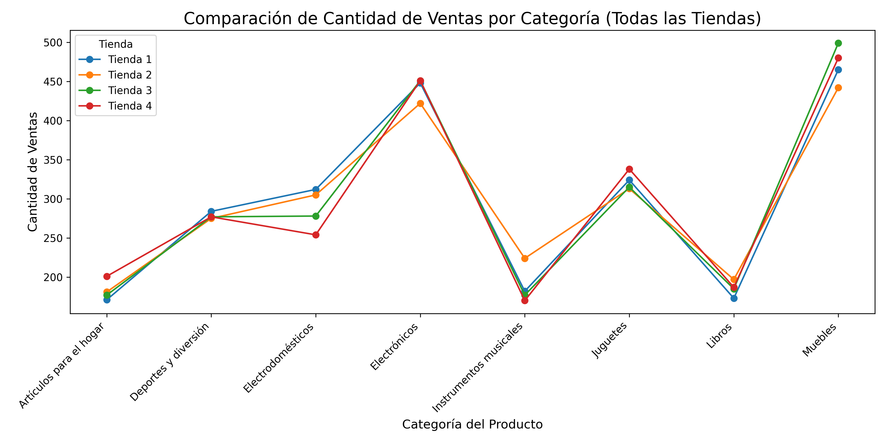

# Asesoria ventas tiendas

## Objetivo
Conocer cual es la tinda con el peor rendimiento para definir su venta

## Inicio

### Conociendo los daros
    Identificamos que todas las listas tienen 2358 filas y 12 columnas con los datos necesarios de cada una de las tiendas

### Ingreso total por tienda
    Se identifica un ingreso total por tienda de la siguiente forma
    Tienda 1: 1.150.880.400 COP
    Tienda 2: 1.116.343.500 COP
    Tienda 3: 1.098.019.600 COP
    Tienda 4: 1.038.375.700 COP

### Ventas por categoria en cada tienda 
    Las ventas por categoria en cada tienda se organiza de la siguiente manera 
    Tienda 1:
      Muebles 465 UN
      Electronicos 448 UN
    Tiedan 2:
      Muebles 442 UN
      Electronicos 422 UN
    Tienda 3:
      Muebles 499 UN
      Electronicos 451 UN
    Tienda 4:
      Muebles 480 UN
      Electronicos 451 UN
    Podemos ver que la tendencia esta en la compra de muebles y electronicos en todas las tiendas, ademas,
    observamos que la tienda 3 es la que mas vende en estas dos categorias, seguida de la tienda 4.
    
### Valoración media por tienda
    Tienda 1: 3.97 promedio de clasificación
    Tienda 2: 4.03 promedio de clasificación
    Tienda 3: 4.04 promedio de clasificación
    Tienda 4: 3.99 promedio de clasificación

### Productos mas y menos vendidos
    Tienda 1: 
        Mas vendidos 
            Armario 60
            TV Led 60
        Menos vendidos 
            Celular 33
            Auriculares 33
        Tienda 2: 
        Mas vendidos 
            Iniciando en programación 60
            Microondas 60
        Menos vendidos 
            Mesa de comedor 34
            Juego de mesa 32
        Tienda 3: 
        Mas vendidos 
            Kit de bancas 57
            Mesa de comedor 56
        Menos vendidos 
            Set de vasos 36
            Bloque de construcción 35
        Tienda 4: 
        Mas vendidos 
            Armario 60
            TV Led 60
        Menos vendidos 
            Celular 33 
            Auriculares 33
            
### Envio promedio por tienda
    Debemos resaltar que este envio lo paga el cliente
    Tienda 1: 26.018 COP
    Tienda 2: 25.216 COP
    Tienda 3: 24.805 COP
    Tienda 4: 23.459 COP

### Analisis grafico de datos 

#### Ventas por tienda 
Este grafico muestra la totalidad de ventas por tienda 

Mayores Ventas en tienda 1 y tienda 2

#### Cantidad de ventas por categoria 
Este grafico muestra la cantidad de ventas por categoria 

Mayor cantidad de ventas en muebles juguetes y electronicos en Tienda 4 y tienda 1 y 3

#### Calificacion promedio por tienda 
Este grafico muestra la calificacion promedio por tienda 

Mayor calificacion promedio en Tienda 3 y tienda 2

#### Mapa de calor de compras
[Ver Mapa de Calor Interactivo](mapa_de_calor_desde_tabla.html)

### Conclusión 
La tienda que se propone vender es la tienda 4 debido a dos razones principales 
1. Peores ingresos totales en el año
2. Segunda peor calificacion en el año
Esto se traduce en que los clientes no estan satisfechos con la atencion y los productos vendidos en esta tienda lo que hace que se tengan las peores ventas anuales y una mala calificación promedio

        
                       
